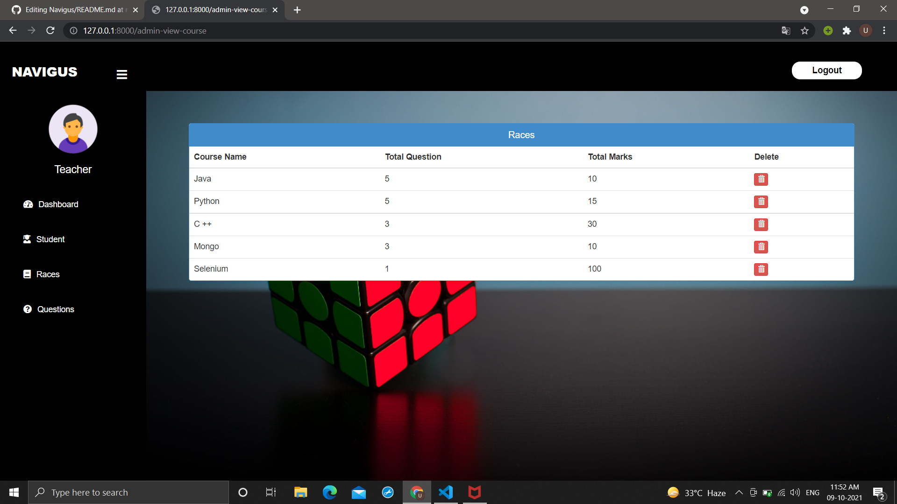
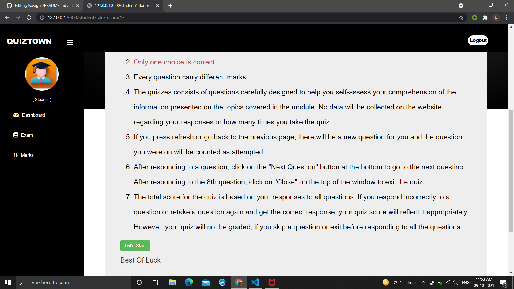

# QUIZMANAGEMENT
Navigus Quiz

# THIS IS HOW OUR WEBSITE LOOKS LIKE!!!
 
 
 

# BEFORE RUNNING CHECK REQUIREMENTS OR INSTALL BELOW MENTIONED 

install python

install django

# Then run this commands

 py manage.py makemigrations
 
py manage.py migrate
 
#The below is to create superuser

 py manage.py createsuperuser 

#The below is to run the server at last

  py manage.py runserver
